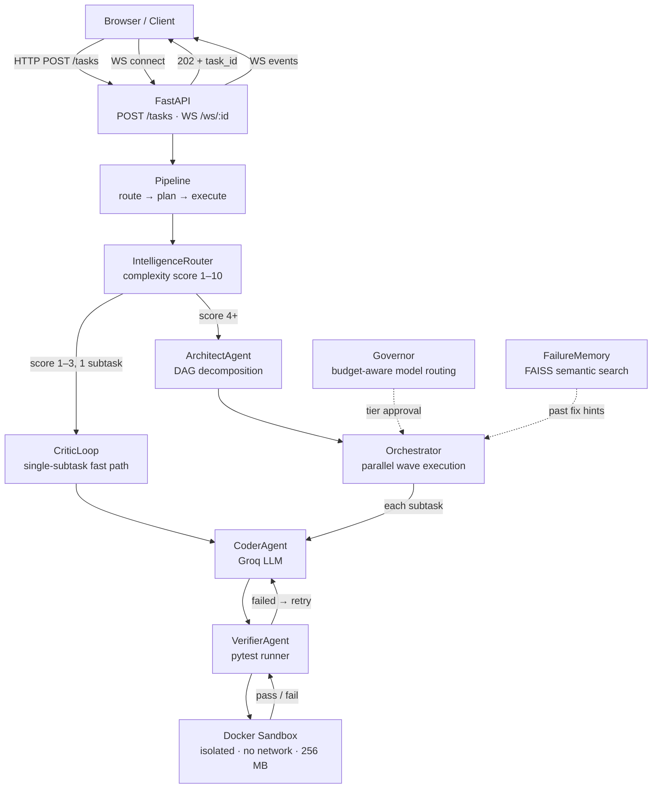
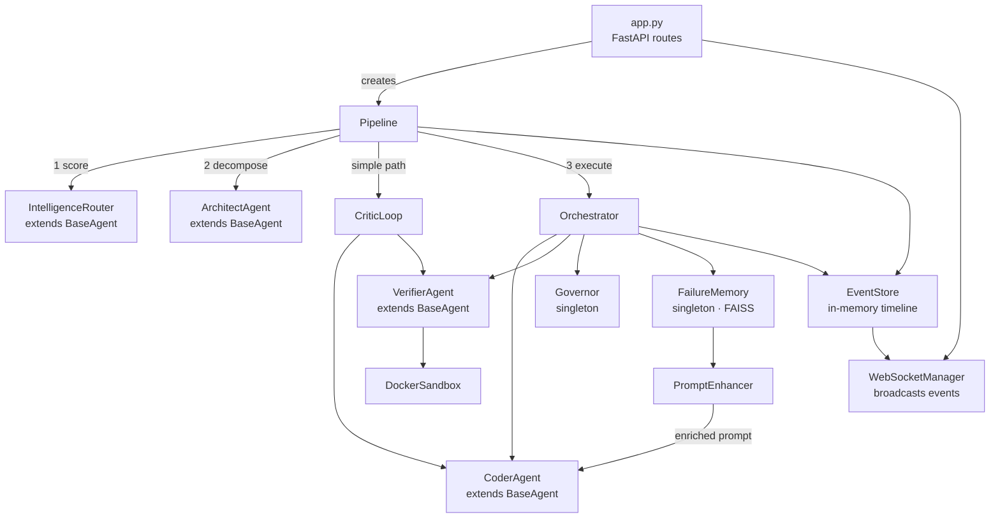
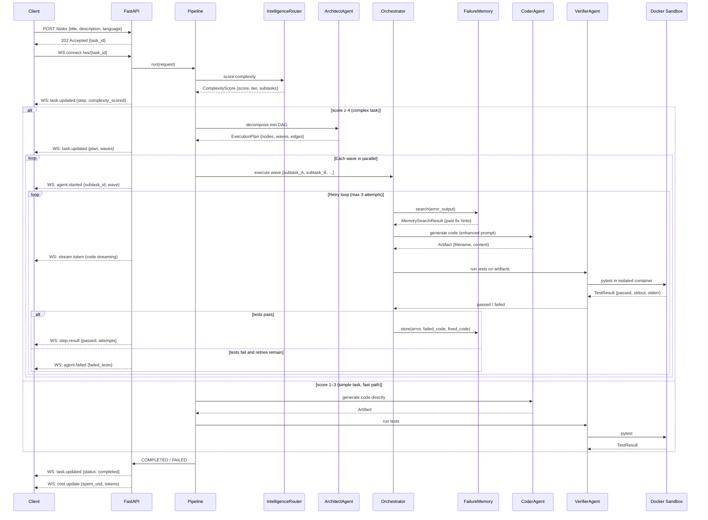

# ATLAS — Self-Healing Multi-Agent Code Assistant

[](https://github.com/sadhuram09/atlas/actions/workflows/ci.yml)

ATLAS is a multi-agent AI system that writes, tests, and fixes code automatically. Submit a task in plain English — "build a Python LRU cache" — and a team of specialised agents plans the work, generates the code, runs the tests in an isolated Docker sandbox, and if anything fails, studies the error and retries with context from past fixes. The loop repeats until all tests pass or retries are exhausted. No human in the coding loop.

---

## Features

- **Self-correcting retry loop** — Coder → Verifier → failure analysis → improved retry, up to 3 attempts per subtask
- **RAG-based failure memory** — FAISS semantic index of past error/fix pairs; each retry prompt is enriched with the most similar previous fixes
- **Budget-aware Governor** — tracks token spend per task in real time and automatically downgrades model tiers (POWERFUL → BALANCED → FAST) as the budget tightens
- **DAG-based parallel execution** — the ArchitectAgent decomposes complex tasks into a dependency graph; independent subtasks execute simultaneously in waves, collapsing wall-clock time
- **Adaptive routing** — the IntelligenceRouter scores task complexity (1–10) and picks the cheapest model tier that can handle it; simple tasks skip the full pipeline entirely
- **Isolated execution** — AI-generated code runs inside a Docker container with no network access and a 256 MB memory cap; it never touches host files
- **Live WebSocket feed** — every agent call, test result, and state transition streams to the browser in real time
- **Interactive API docs** — auto-generated Swagger UI at `/docs` in development

---

## Tech Stack

| Layer | Technology |
|---|---|
| Language | Python 3.12 |
| API framework | FastAPI + WebSockets |
| Async runtime | asyncio |
| Data contracts | Pydantic v2 |
| Dependency management | Poetry |
| LLM provider | Groq API (OpenAI-compatible SDK) |
| LLM models | `llama-3.1-8b-instant` · `llama-3.3-70b-versatile` · `deepseek-r1-distill-llama-70b` |
| Memory / RAG | FAISS + sentence-transformers (`all-MiniLM-L6-v2`) |
| Code sandbox | Docker (subprocess, network=none, 256 MB) |
| Observability | structlog |
| CI | GitHub Actions |
| Backend hosting | Render |
| Frontend hosting | Vercel (static HTML) |

---

## Architecture

### High-Level Design



### Low-Level Design



### Task Lifecycle (Sequence Diagram)



---

## Core Components

### 1. ArchitectAgent
Decomposes a complex task into a dependency DAG. Each node is a subtask with its own description, assigned model tier, and list of predecessor nodes it depends on. The ArchitectAgent also computes execution waves — groups of nodes with no inter-dependencies — so the Orchestrator can run them in parallel. A task like "build a URL shortener" becomes four nodes across three waves, with the first two nodes executing simultaneously.

### 2. CoderAgent
Calls the Groq LLM to generate implementation code and a corresponding test file. On retry attempts, the prompt is enriched by the PromptEnhancer with the raw pytest failure output and any matching patterns from FailureMemory, giving the model concrete context about what broke and how similar issues were fixed before.

### 3. VerifierAgent
Passes the CoderAgent's artifacts to DockerSandbox, which writes them to a temporary directory, mounts it read-only into a `python:3.12-slim` container with `network=none`, and runs `pytest`. The container is destroyed after each run. The VerifierAgent parses pytest stdout into a `TestResult` (passed, test count, failed test names) and returns a binary verdict to the Orchestrator.

### 4. Governor
A singleton that tracks per-task token spend and enforces budget policy before every LLM call. When budget utilisation crosses 70%, the Governor downgrades model tier by one step (POWERFUL → BALANCED, BALANCED → FAST). Above 90% it forces FAST for all remaining calls. This means a task that hits trouble and burns extra retries doesn't silently overspend — it automatically switches to cheaper models.

### 5. FailureMemory
A FAISS inner-product index over sentence-transformer embeddings (`all-MiniLM-L6-v2`, 384 dims) of past error messages. Whenever a subtask passes after one or more retries, the (error output, broken code, fixed code) triple is stored. On every subsequent retry, FailureMemory finds the top-3 most semantically similar past failures and the PromptEnhancer injects them into the CoderAgent's prompt. Falls back to Jaccard keyword similarity when FAISS is unavailable (e.g., production environments with tight RAM limits).

---

## API Reference

| Method | Route | Description |
|---|---|---|
| `GET` | `/health` | Liveness check — returns version, task counts, and active WS connections |
| `GET` | `/stats` | System-wide stats: tasks, Governor spend, FailureMemory pattern count |
| `POST` | `/tasks` | Submit a task; returns `202 Accepted` with `task_id` immediately |
| `GET` | `/tasks` | List all tasks (default limit 50) |
| `GET` | `/tasks/{id}` | Get task detail and current status |
| `GET` | `/tasks/{id}/timeline` | Full ordered event history — powers the dashboard DAG visualiser |
| `GET` | `/tasks/{id}/budget` | Real-time Governor budget state for a task |
| `DELETE` | `/tasks/{id}` | Cancel a running task |
| `GET` | `/memory/stats` | FailureMemory index stats |
| `WS` | `/ws/{task_id}` | Subscribe to live events for a task |

Interactive docs (development only): `http://localhost:8000/docs`

---

## Getting Started

### Prerequisites

| Tool | Version |
|---|---|
| Python | 3.12+ |
| Poetry | 1.8+ |
| Docker | 24+ (for the code sandbox) |

### Clone and install

```bash
git clone https://github.com/sadhuram09/atlas.git
cd atlas
poetry install
```

### Configure environment

```bash
cp .env.example .env
```

Open `.env` and set your Groq API key (free at [console.groq.com](https://console.groq.com/keys)):

```env
GROQ_API_KEY=gsk_your_key_here
ENVIRONMENT=development
```

No database or LangSmith key needed to run locally.

### Run locally

```bash
poetry run uvicorn atlas.api.app:app --host 0.0.0.0 --port 8000 --reload
```

Server starts at `http://localhost:8000`. Submit a task:

```bash
curl -X POST http://localhost:8000/tasks \
  -H "Content-Type: application/json" \
  -d '{
    "title": "Write a Fibonacci function",
    "description": "Python function returning the nth Fibonacci number using memoisation",
    "language": "python"
  }'
```

Then connect a WebSocket client to `ws://localhost:8000/ws/{task_id}` to watch the agent loop in real time.

### Run tests

```bash
poetry run pytest
```

Tests run without LLM calls — a placeholder API key is sufficient.

---

## Deployment

| Layer | Platform | URL |
|---|---|---|
| Backend | Render | https://atlas-v9x1.onrender.com |
| Frontend | Vercel | https://atlas-hero-mu.vercel.app |

Every push to `master` triggers the GitHub Actions CI pipeline (lint + tests). The backend redeploys automatically via Render's git integration; the frontend via Vercel's git integration. See `DEPLOYMENT.md` for full setup instructions including environment variable configuration.

---

## License

No license file is currently included in this repository.
